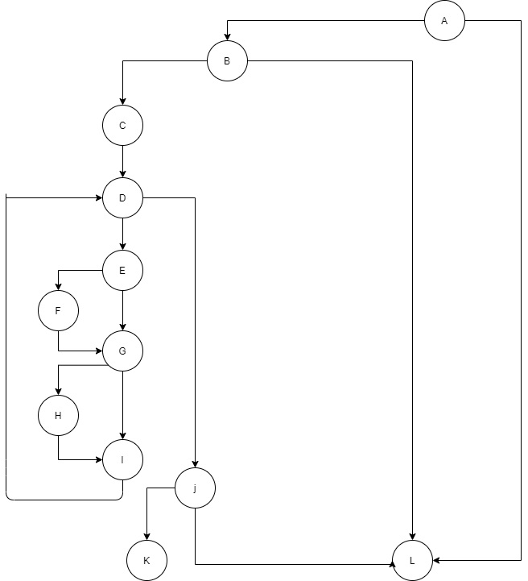

# SI_lab2_183079
# Тамара Даниловска, бр. на индекс 183079

Група на код:
Ја добив групата на код 1

* Control Flow Graph

* Цикломатска комплексност

	Цикломатската комплексност на овој код е 6, истата ја добив преку пресметуванје на бројот на ребра-бројот на јазли + 2. бројот на ребра е 16 а бројот на јазли е 12 и според формулата имаме 16-12+2=6

* Тест случаи според критериумот Every statement

	Имаме вкупно 6 тест случаи за овој критериум 

	За тест случај 1 ги имаме следниве променливи 
				
		allUsers	//praznalista	
		user1  		null

	За тест случај 2 ги имаме следниве променливи 

		allUsers	//praznalista	
		user2		
			username	Tamss
			password	Sakammecinja
			email		tamss.568@gmail.com

	За тест случај 3 ги имаме следниве променливи 

		allUsers	//praznalista	
		user3		
			username	Tamss2
			password	SakamKviki
			email		tamss222.gmail.com

	За тест случај 4 ги имаме следниве променливи 

		allUsers	//praznalista	
		user4		
			username	Tams
			password	lalalalalala
			email		tams.la@hotmail,com

	За тест случај 5 ги имаме следниве променливи 

		allUsers	user2	
		user5		
			username	null
			password	hsao
			email		hsao@gmail.com

	Табелата за обој критериум може да ја најдете во репото под име Every_Statement_Tests.xlsx

* Тест случаи според критериумот Multiple Condition

	Имаме вкупно 5 тест случаи за овој критериум 

	За тест случај 1 ги имаме следниве променливи 
				
		allUsers	//praznalista	
		user1		null

	За тест случај 2 ги имаме следниве променливи 

		allUsers	//praznalista	
		user2		
			username	Tamss
			password	Sakammecinja
			email		tamss.568@gmail.com

	За тест случај 3 ги имаме следниве променливи 

		allUsers	//praznalista	
		user3		
			username	Tamss2
			password	Sakamkviki
			email		tamss222.gmail.com

	За тест случај 4 ги имаме следниве променливи 

		allUsers	Tamss	
		user7		
			username	Tamss
			password	SAkammecinja
			email		tamss.568@gmail,com

	За тест случај 5 ги имаме следниве променливи 

		allUsers	//praznalista	
		user8		
			username	Jony
			password	Sonceto5
			email		null

	За тест случај 6 ги имаме следниве променливи 

		allUsers	//praznalista	
		user6		
			username	null
			password	Sonceto5
			email		jony.569@gmail.com

	Табелата за обој критериум може да ја најдете во репото под име Multiple_Condition.xlsx

* Објаснување на напишаните unit tests

	EVERY STATEMENT 

		За тест случај 1 имаме вредност на user објектот null што значи дека првиот услов не е исполнет и програмата ќе врати false

		За тест случај 2 имеме објект каде што сите вредности се валидни па затоа програмата ќе врати true

		За тест случај 3 имаме објект каде што променливата email во user3 објектот има погрешна вредност (email = tamss222.gmail.com) па јазолот F нема да се изврши што ќе резултира програмата да врати резултат false

		За тест случај 4 имаме објект каде што променливата email во user4 објектот има погрешна вредност (email = tams.la@hotmail,com) па јазолот H нема да се изврши што ќе резултира програмата да врати резултат false

		За тест случај 5 имаме објект каде што променливата username во user5 објектот нема вредност односно има вредност null па условот претставен со јазолот B нема да се изврши што ќе резултира програмата да врати резултат false

	MULTIPLE CONDITION 

		За условот претставен со јазол А имаме 2 можни комбинации. Програмата може да врати услов true доколку test2 биде приложен за тестирање или false доколку test1 се тестира

		За условот претставен со јазол B имаме 8 можни комбинации но со lazy evaluation имаме 4 случаи. Комбинацијата TTT кога се извршува test2, комнинацијата  TTF за test3, TFX за test5, и FXX за test6.
		
		За условот претставен со јазол E имаме 2 можни комбинации. Условот е исполнет кога се извршува test2 а не е исполнет кога се извршува test4.
		
		За условот претставен со јазол G имаме 4 можни комбинации но со lazy evaluation имаме 3. Комбинацијата TT кога се извршува test2, комнинацијата  TF за test4  и FX за test3.
		
		За условот претставен со јазол J имаме 4 можни комбинации но со lazy evaluation имаме 3. Комбинацијата TT кога се извршува test2, комнинацијата  TF за test3  и FX за test4.		
